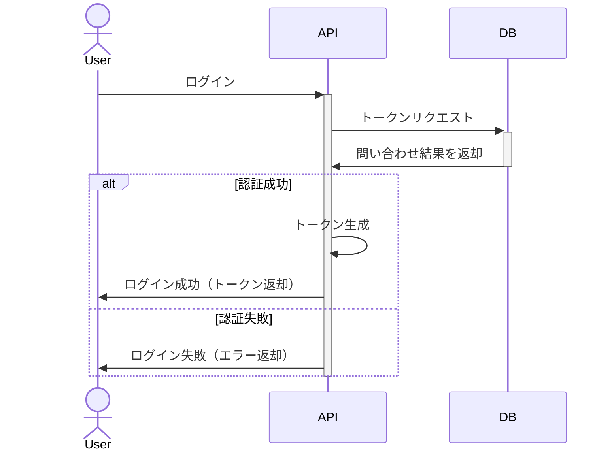

```mermaid
sequenceDiagram
    actor User
    participant API
    participant DB

    User->>+API: ログイン
    API->>+DB: トークンリクエスト
    DB->>-API: 問い合わせ結果を返却
    alt 認証成功
        API->>API: トークン生成
        API->>User: ログイン成功（トークン返却）
    else 認証失敗
        API->>User: ログイン失敗（エラー返却）
    end
    deactivate API
```
