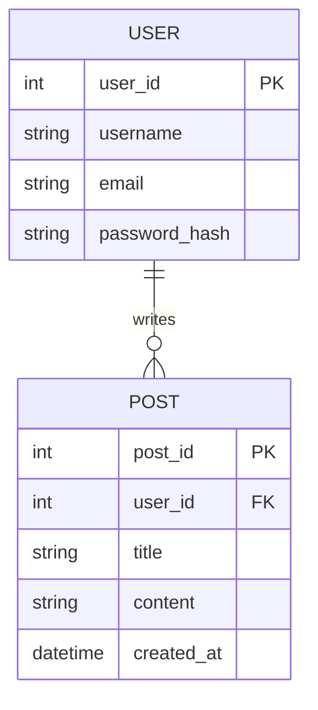

```mermaid
erDiagram
    USER {
        int user_id PK
        string username
        string email
        string password_hash
    }
    
    POST {
        int post_id PK
        int user_id FK
        string title
        string content
        datetime created_at
    }
    
    USER ||--o{ POST : writes
```
